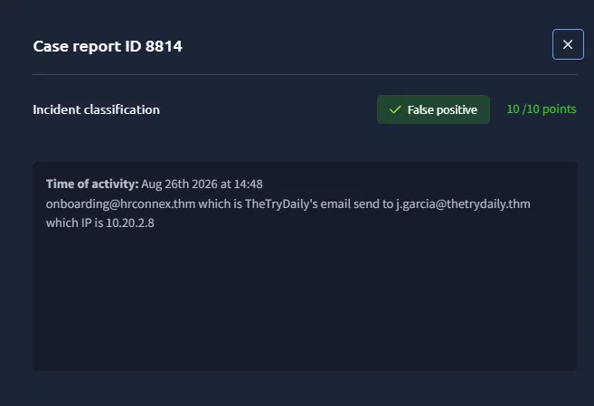
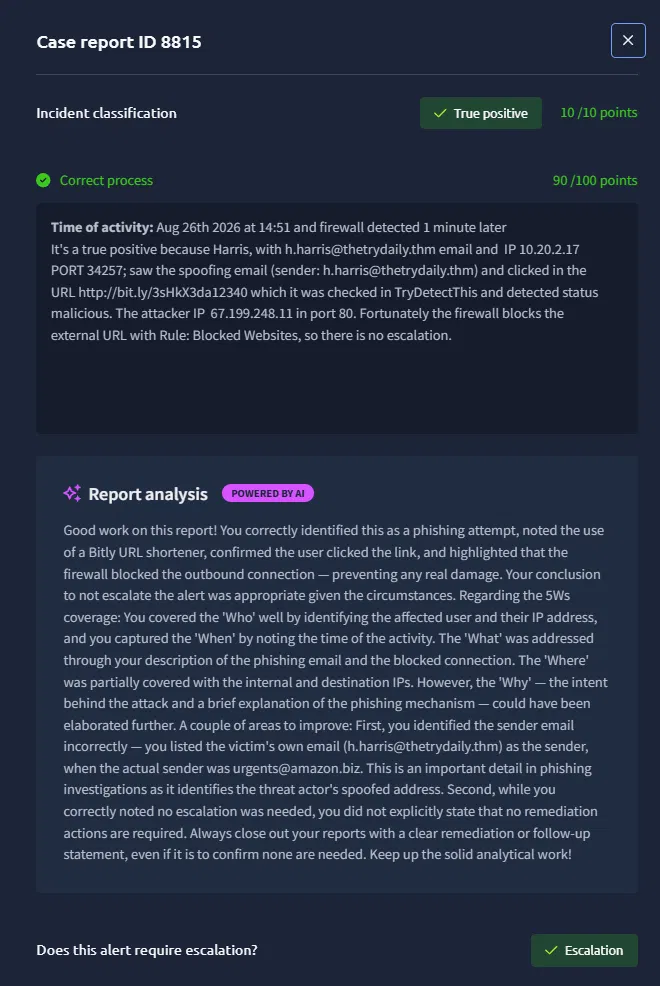
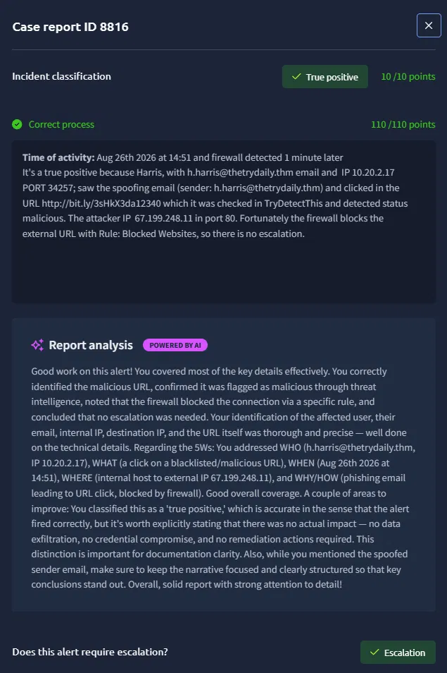
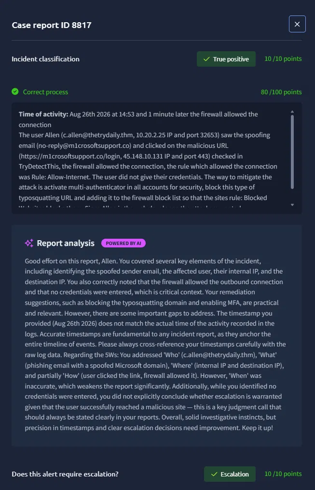
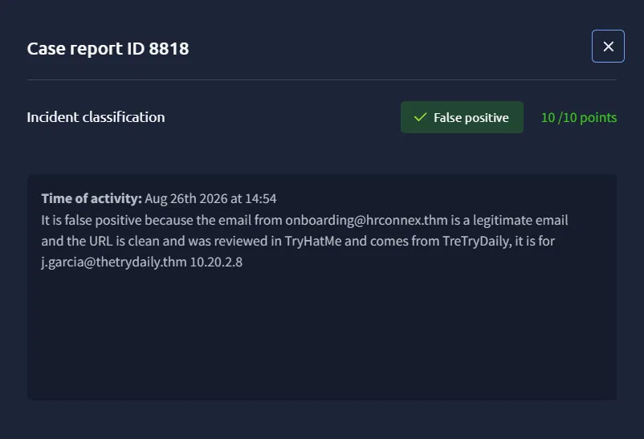

# Introduction to Phishing — SOC Simulator (TryHackMe)

**Dificultad:** Easy | **Tiempo:** 10 min

## Escenario
Llegaron 5 alertas, de las cuales 2 eran falsos positivos y 3 verdaderos positivos.

## Triage
Se revisó el remitente, cabeceras, URLs, IPs y logs.

## Veredictos
- **8814** — Falso positivo
- **8815** — Verdadero positivo
- **8816** — Verdadero positivo
- **8817** — Verdadero positivo
- **8818** — Falso positivo

## Reportes

### Alerta 8814 — 10/10 points — Falso positivo

**Time of activity:** Aug 26th 2026 at 14:48
El correo onboarding@hrconnex.thm (HR de TheTryDaily) fue enviado a j.garcia@thetrydaily.thm, IP 10.20.2.8. Correo legítimo, sin indicios de phishing.

---

### Alerta 8815 — 10/10 points — Verdadero positivo (90/100 en calidad de reporte)

**Time of activity:** Aug 26th 2026 at 14:51, firewall detectó 1 minuto después.
Harris (h.harris@thetrydaily.thm, IP 10.20.2.17, puerto 34257) vio el correo spoofed y dio clic en la URL http://bit.ly/3sHkX3da12340, verificada en TryDetectThis con estado malicioso. IP del atacante: 67.199.248.11, puerto 80. El firewall bloqueó la URL externa con la regla "Blocked Websites", por lo que no hubo escalación.

**Feedback de IA:** buen trabajo identificando el phishing, el uso del acortador Bitly, el clic del usuario y el bloqueo del firewall. Cobertura de las 5W: bien en Who y When; parcial en Where; la 'Why' pudo profundizarse más en la intención del ataque. **Error clave:** se identificó mal el remitente — se puso el correo de la víctima (h.harris@thetrydaily.thm) en vez del remitente real y falsificado, **urgents@amazon.biz**. Además, faltó declarar explícitamente que no se requerían acciones de remediación.

---

### Alerta 8816 — 10/10 points — Verdadero positivo (110/110 en calidad de reporte)

**Time of activity:** Aug 26th 2026 at 14:51, firewall detectó 1 minuto después.
Mismo incidente que la alerta 8815: Harris (h.harris@thetrydaily.thm, IP 10.20.2.17, puerto 34257) dio clic en la URL maliciosa http://bit.ly/3sHkX3da12340. IP del atacante: 67.199.248.11, puerto 80. El firewall bloqueó la conexión con la regla "Blocked Websites", sin escalación.

**Feedback de IA:** reporte completo — cubre correctamente las 5W (Who, What, When, Where, Why/How). Único punto de mejora: aclarar explícitamente que, al ser un "true positive" sin impacto real (sin exfiltración de datos, sin compromiso de credenciales), conviene declararlo así para mayor claridad documental.

---

### Alerta 8817 — 10/10 points — Verdadero positivo (80/100 en calidad de reporte, 10/10 en escalación)

**Time of activity:** Aug 26th 2026 at 14:53, 1 minuto después el firewall permitió la conexión.
El usuario Allen (c.allen@thetrydaily.thm, IP 10.20.2.25, puerto 32653) vio el correo spoofed (no-reply@m1crosoftsupport.co) y dio clic en la URL maliciosa (https://m1crosoftsupport.co/login, IP 45.148.10.131, puerto 443), verificada en TryDetectThis. El firewall permitió la conexión bajo la regla "Allow-Internet". El usuario no ingresó sus credenciales.

**Mitigación:** activar MFA en todas las cuentas, bloquear este tipo de URLs de typosquatting y agregarlas a la lista de bloqueo del firewall para que la regla "Blocked Websites" las cubra. Al ser Allen el desarrollador web, los atacantes buscaban comprometer el sistema web.

**Feedback de IA:** se cubrieron bien el remitente spoofed, el usuario afectado, IPs interna/destino, que el firewall permitió la conexión, y que no se entregaron credenciales. Las sugerencias de mitigación (MFA, bloqueo de dominio typosquatting) fueron acertadas. **Errores clave:** el timestamp reportado no coincidía con el de los logs reales — siempre hay que cross-referenciar las marcas de tiempo con los logs crudos. Además, aunque el usuario llegó al sitio malicioso, no se concluyó explícitamente si la alerta requería escalación, siendo esta una decisión de juicio crítica que siempre debe quedar explícita en el reporte.

---

### Alerta 8818 — 10/10 points — Falso positivo

**Time of activity:** Aug 26th 2026 at 14:54
El correo onboarding@hrconnex.thm es legítimo y la URL es limpia, verificada en TryDetectThis, proveniente de TheTryDaily, dirigido a j.garcia@thetrydaily.thm, IP 10.20.2.8.

## Técnicas MITRE ATT&CK

| Técnica | Nombre | Link |
|---|---|---|
| T1566.002 | Phishing: Spearphishing Link | https://attack.mitre.org/techniques/T1566/002/ |
| T1583.001 | Acquire Infrastructure: Domains | https://attack.mitre.org/techniques/T1583/001/ |
| T1071.001 | Application Layer Protocol: Web Protocols | https://attack.mitre.org/techniques/T1071/001/ |
| T1656 | Impersonation | https://attack.mitre.org/techniques/T1656/ |
| T1204.001 | User Execution: Malicious Link | https://attack.mitre.org/techniques/T1204/001/ |

## Aprendizajes

**Metodología de Análisis (Las 5 Ws):** Estructuración del proceso de triage respondiendo sistemáticamente a Who (usuarios/remitentes), What (evento/payload), When (marcas de tiempo), Where (IPs de origen/destino y puertos) y Why (intención táctica del adversario).

**Investigación y Filtrado en SIEM (Splunk):** Ejecución de consultas mediante SPL para correlacionar eventos de red, filtrar logs de firewall por IP/puerto, rastrear sesiones iniciadas desde endpoints específicos y verificar la aplicación de reglas de tráfico.

**Criterios de Clasificación (TP vs. FP):** Validación de legitimidad analizando la reputación de dominios/URLs, inconsistencias en el encabezado de correo (suplantación de remitente) y evaluación del contexto operativo antes de emitir un veredicto.

**Evaluación de Escalación y Respuesta:** Toma de decisiones basada en el impacto real; diferenciación entre incidentes contenidos automáticamente a nivel de red (bloqueo por firewall, sin necesidad de escalación) e incidentes con conexión establecida hacia infraestructura externa maliciosa (requieren contención, bloqueo de IoCs y medidas de mitigación como MFA).

**Mapeo a Marcos de Ciberseguridad:** Traducción de la evidencia observada en logs y acciones del usuario a técnicas formales de la matriz MITRE ATT&CK para estandarizar el reporte técnico del incidente.

**Precisión en Timestamps:** La importancia de cross-referenciar siempre las marcas de tiempo reportadas contra los logs crudos, ya que discrepancias en el timeline debilitan la credibilidad del reporte.

**Claridad en Decisiones de Escalación:** Todo reporte debe cerrar con una conclusión explícita sobre si se requiere o no escalación/remediación, incluso cuando la respuesta es "no se necesita ninguna acción".